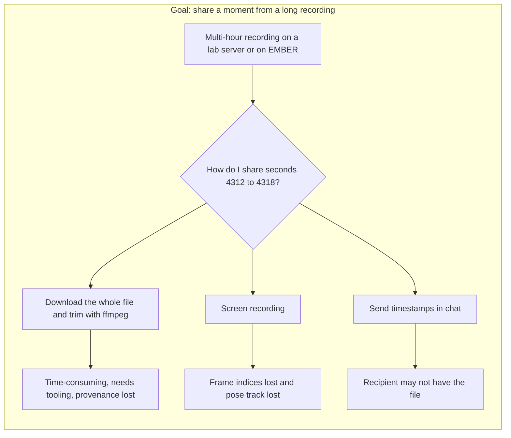
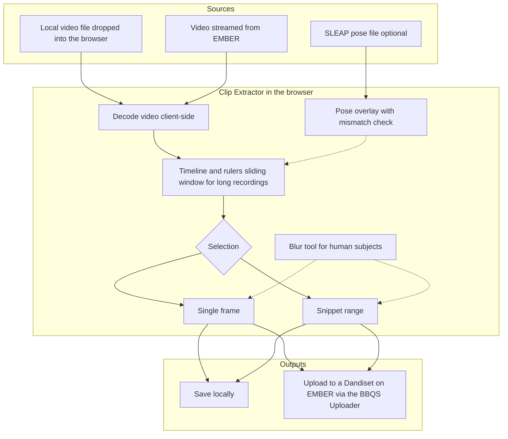

# Clip Extractor: user stories

User stories in support of the **Clip Extractor** usability; a web application for selecting a clip from a video, either a snippet (a range of frames) or a single frame, and either saving it locally or uploading it directly to the EMBER Archive.

- Application: https://clip-extractor.brain-bbqs.org
- Source code: https://github.com/brain-bbqs/clip-extractor

> [!NOTE]
> The need for this tool surfaced in the **Pose Estimation Task Force** discussions at the **2026 BBQS workshop**. The stories here are a written-down version of those discussions and of the follow-on needs that emerged once the tool was connected to the EMBER Archive. They are meant to be revised by the task force as the tool evolves.

Each story is written as _As a [kind of user], I want [a capability], so that [an outcome I care about]_, followed by why it matters, acceptance criteria that someone other than the author could check, and a diagram of the workflow.

**Contents**

1. [Problem](#problem)
2. [Solution](#solution)
3. [Users](#users)
4. [Stories](#stories)
5. [Future stories](#future-stories)
6. [What the tool is not](#what-the-tool-is-not)
7. [Contributing a story](#contributing-a-story)

---

## Problem

Behavioral recordings in BBQS are long. A single session can run for hours and a single file can be tens of gigabytes. The interesting moments, however, are short: a few seconds where a tracker loses an animal, a single frame where two subjects overlap, a bout of a rare behavior that a model should learn to recognize.

Before the Clip Extractor, moving one of those moments from a recording to a colleague, another task force, an annotation tool, or the archive meant one of the following:

Each of these loses either the **precision** (which frames, exactly?), the **provenance** (which recording did this come from?), or the **pose track** (the overlay data that could be re-applied to the video; the human-annotated labels vs. auto-generated series). All of them are slow enough that people skip the step.

## Solution

The Clip Extractor runs entirely in the browser. It decodes video client-side, lets the user scrub to a frame or mark a range, optionally overlays pose data from a SLEAP file, and produces either a still image or a trimmed video clip. The output can be saved locally or, when the user is signed in and has an appropriate Dandiset on EMBER, uploaded directly as a derivative with BEP047-compliant organization.

## Users

| Persona                                | Short description                                                              | Typical need                                                                                                              |
| -------------------------------------- | ------------------------------------------------------------------------------ | ------------------------------------------------------------------------------------------------------------------------- |
| **Pose estimation researcher**         | Trains or evaluates SLEAP, DeepLabCut, or LightPose models on BBQS recordings. | Share a failure case or a benchmark segment with the exact frame indices and pose overlay intact.                         |
| **Data steward for a BBQS lab**        | Responsible for getting the lab's data onto EMBER in standard form.            | Produce clips for demonstration purposes.                                                                                 |
| **Task force or working group member** | Reviews examples across labs to define standards such as skeleton definitions. | Grab a representative frame from any accessible recording on EMBER without downloading the entire file.                   |
| **Compliance-minded PI**               | Works with human subjects data or embargoed datasets.                          | Be confident that nothing leaves the browser unintentionally and that identifiable content can be blurred before sharing. |

## Stories

Each story lives in its own file in this folder.

### Pose estimation

These stories come most directly from the Pose Estimation Task Force discussions. The common thread is that pose estimation work is done on **short, specific moments** inside **long recordings**, and that those moments need to travel between people and tools without losing their frame indices or their pose context.

| Story                                                                                                                           | What it covers                                                                              |
| ------------------------------------------------------------------------------------------------------------------------------- | ------------------------------------------------------------------------------------------- |
| [Story 1: Share a tracking failure case](story-01-share-a-tracking-failure-case.md)                                             | Extract the seconds where a tracker failed, pose overlay intact, and share them.            |
| [Story 2: Curate benchmark and training clips](story-02-curate-benchmark-and-training-clips.md)                                 | Pull short, representative clips out of many long recordings for benchmarks and annotation. |
| [Story 3: Verify that a pose file belongs to this video](story-03-verify-that-a-pose-file-belongs-to-this-video.md)             | Catch a pose file that does not belong to the video before it reaches a shared clip.        |
| [Story 4: Capture a reference frame for a skeleton definition](story-04-capture-a-reference-frame-for-a-skeleton-definition.md) | Grab one exact frame to anchor a skeleton definition in a real example.                     |

### Archive workflows

These stories are about the Clip Extractor as a **front door to EMBER**. The tool is only worth building as a separate application if it makes archive-centred workflows easier than the alternative of downloading, trimming, renaming, and re-uploading by hand.

| Story                                                                                                                                                               | What it covers                                                                   |
| ------------------------------------------------------------------------------------------------------------------------------------------------------------------- | -------------------------------------------------------------------------------- |
| [Story 5: Clip a recording on EMBER without downloading it](story-05-clip-a-recording-on-ember-without-downloading-it.md)                                           | Open a video that already lives in a Dandiset and clip it without downloading.   |
| [Story 6: Upload a derivative that lands in the right place with the right name](story-06-upload-a-derivative-that-lands-in-the-right-place-with-the-right-name.md) | Upload the clip into the right Dandiset with BEP047-compliant naming and layout. |
| [Story 7: Work with multi-hour recordings](story-07-work-with-multi-hour-recordings.md)                                                                             | Stay frame-accurate and responsive on overnight and multi-hour recordings.       |
| [Story 8: Keep audio with video when it exists](story-08-keep-audio-with-video-when-it-exists.md)                                                                   | Recognize an audio track and label the output for what it actually contains.     |

### Privacy and provenance

BBQS data includes human subjects recordings and embargoed datasets. A tool that makes sharing clips easy also makes sharing the wrong clip easy. These stories are the guardrails that make the convenience of the Clip Extractor acceptable to a compliance-minded PI and to the archive.

| Story                                                                                                         | What it covers                                                                     |
| ------------------------------------------------------------------------------------------------------------- | ---------------------------------------------------------------------------------- |
| [Story 9: Nothing leaves the browser unless I say so](story-09-nothing-leaves-the-browser-unless-i-say-so.md) | Decode and trim locally; nothing is transmitted until an explicit upload.          |
| [Story 10: Blur people before sharing](story-10-blur-people-before-sharing.md)                                | Get warned on human-subjects datasets and redact faces before sharing.             |
| [Story 11: Respect embargo status](story-11-respect-embargo-status.md)                                        | Allow uploads only where adding a derivative is appropriate, and say why when not. |
| [Story 12: Record where a clip came from](story-12-record-where-a-clip-came-from.md)                          | Carry recording, subject, session, dataset, and frame range with every clip.       |

## Future stories

Needs that the task force raised, or that follow naturally from the stories above, and that are tracked as planned work in the Clip Extractor repository.

| Story                                                                                                                                                                                                                                                                           | Theme                  | Status  | Tracking                                                                    |
| ------------------------------------------------------------------------------------------------------------------------------------------------------------------------------------------------------------------------------------------------------------------------------- | ---------------------- | ------- | --------------------------------------------------------------------------- |
| As a researcher, I want to see pose overlays for recordings streamed from EMBER, using derivative pose data already stored in the archive, so that I do not need a local copy of the pose file.                                                                                 | Pose estimation        | Planned | [clip-extractor#46](https://github.com/brain-bbqs/clip-extractor/issues/46) |
| As a data steward, when I clip a video that is already standardized in BEP047 on EMBER, I want device and acquisition metadata that cannot be determined from the video itself to be copied from the source sidecar, so that the derivative is as well-described as its parent. | Archive workflows      | Planned | [clip-extractor#48](https://github.com/brain-bbqs/clip-extractor/issues/48) |
| As a data steward, when uploading a derivative back into the same Dandiset it came from, I want the tool to write only the derivative and not a duplicate of the source, so that the archive stays free of redundant copies.                                                    | Archive workflows      | Planned | [clip-extractor#48](https://github.com/brain-bbqs/clip-extractor/issues/48) |
| As a data steward, I want the derivative to carry full BEP028 provenance describing the tool, version, parameters, and source, so that the archive can answer "how was this produced?" in a machine-readable way.                                                               | Privacy and provenance | Planned | [clip-extractor#42](https://github.com/brain-bbqs/clip-extractor/issues/42) |

## What the tool is not

Keeping scope honest is part of the justification.

- It is **not a video editor**. There is no compositing, no multi-clip timeline, no re-encoding options beyond what is needed to produce a clip.
- It is **not an annotation tool**. It shows existing pose data as an overlay so you can judge it; it does not let you edit keypoints or label behavior. Those needs are covered by the Behavioral Annotation Task Force's platform and by tools such as SLEAP and DeepLabCut.
- It is **not a bulk pipeline**. It is for one moment at a time, chosen by a person. Batch extraction belongs in scripts run against the archive.

## Contributing a story

Stories are living documents. If your team has a need that is not captured here, or a story does not match how you actually work, open a pull request.

Copy the [story template](../story-template.md) into this folder as `story-<counter>-<descriptor>.md`, continuing the numbering above, then link it from the index. See [contributing a story](../README.md#contributing-a-story) for the full instructions and conventions.
