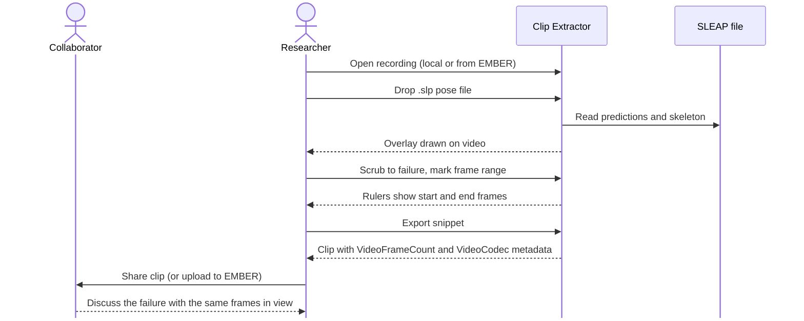

# Story 1: Share a tracking failure case

**Persona:** Scientific researcher using pose estimation as a part of analysis pipeline.

> As a **pose estimation researcher**, I want to extract the few seconds where my tracker lost an animal, with the predicted pose drawn on top, so that I can show a collaborator or the task force exactly what went wrong without sending a multi-gigabyte recording.

**Why it matters.** Most of the useful conversation in pose estimation is about failures: identity swaps, dropped keypoints, occlusions. Today those conversations happen over screenshots or vague timestamps. A screenshot loses the motion that explains the failure. A timestamp assumes the recipient has the file.

**Acceptance criteria**

- I can open a local video file or a video on EMBER and scrub to the frame where the failure begins.
- I can mark a snippet range by frame, not just by rough time, and the rulers show me which frames are included.
- I can load a SLEAP `.slp` file and see the predicted skeleton drawn over the video while I scrub.
- The exported clip carries the frame count and codec information so the recipient can line it back up against the source.
- The whole process takes minutes, not an afternoon, and requires no command-line tools.

---

[All Clip Extractor stories](README.md) · Next: [Story 2](story-02-curate-benchmark-and-training-clips.md)
