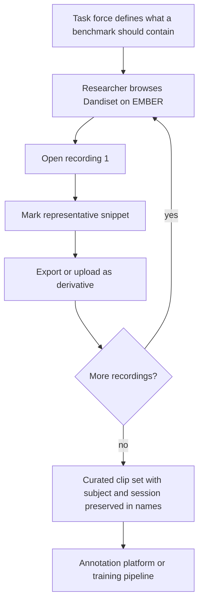

# Story 2: Curate benchmark and training clips

**Persona:** Pose estimation researcher, working with the Behavioral Annotation Task Force.

> As a **pose estimation researcher**, I want to pull short, representative clips out of many long recordings, so that the task force can assemble benchmark sets and annotation batches from moments that matter rather than from whole sessions.

**Why it matters.** The Behavioral Annotation Task Force is building a centralized collection of rodent videos for crowdsourced labeling, with milestones measured in millions of labeled frames. Annotators and annotation tools work far better on focused clips than on hour-long files. Someone has to choose those clips, and the person best placed to choose is the researcher who knows where the interesting behavior is.

**Acceptance criteria**

- I can browse videos in a Dandiset on EMBER from inside the tool and open one without downloading it first.
- I can extract a snippet and have it named consistently with the source subject and session, so a curated set stays traceable.
- Repeating the process across several recordings does not require re-learning the tool or re-authenticating each time.
- The exported clips are ordinary video files that annotation platforms and training pipelines can ingest without conversion.

---

[All Clip Extractor stories](README.md) · Previous: [Story 1](story-01-share-a-tracking-failure-case.md) · Next: [Story 3](story-03-verify-that-a-pose-file-belongs-to-this-video.md)
