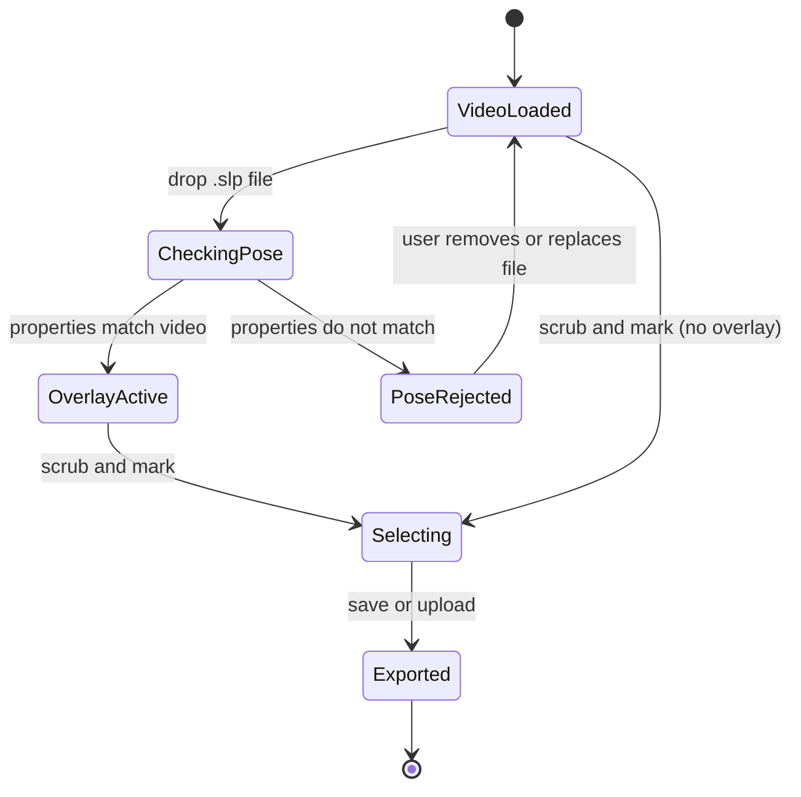

# Story 3: Verify that a pose file belongs to this video

**Persona:** Pose estimation researcher; behavioral annotator.

> As a **pose estimation researcher**, I want the tool to tell me when the pose file I loaded does not match the video I am looking at, so that I do not share or archive a clip whose overlay describes a different recording.

**Why it matters.** Pose files and videos get separated. Filenames drift, sessions get re-exported, and a `.slp` from one recording is easily dropped onto another. An overlay that is subtly wrong is worse than no overlay, because it looks authoritative.

**Acceptance criteria**

- When I load a pose file whose properties do not match the video (for example, a different frame count or dimensions), the tool refuses the overlay and tells me why.
- When the pose file does match, the overlay tracks the video frame-accurately as I scrub.
- The mismatch check happens before I export, so a bad pairing cannot silently end up in a shared clip.

---

[All Clip Extractor stories](README.md) · Previous: [Story 2](story-02-curate-benchmark-and-training-clips.md) · Next: [Story 4](story-04-capture-a-reference-frame-for-a-skeleton-definition.md)
