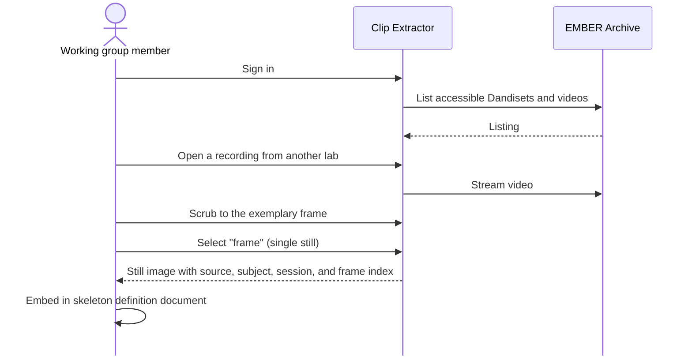

# Story 4: Capture a reference frame for a skeleton definition

**Persona:** Task force or working group member.

> As a **member of a standards working group**, I want to grab a single, exact frame from any recording I can access on EMBER, so that skeleton definitions and annotation guidelines can point at real examples instead of drawings.

**Why it matters.** The Behavioral Annotation Task Force has called for rigorous, anatomically justified standard skeleton definitions. Writing such a definition means saying "this is what we mean by the left hind paw keypoint on this species in this camera view" and showing it. That requires precise frames from real recordings across labs, which in turn requires being able to open those recordings without downloading them.

**Acceptance criteria**

- I can select a single frame, rather than a range, and export it as a still image.
- Frame extraction works even in environments where full video re-encoding is not available, because a still does not require it.
- The still keeps enough context (source dataset, subject, session, frame index) that a reader of the guideline can find the original.
- I can do this for a recording on EMBER while signed in, without first copying the file to my machine.

---

[All Clip Extractor stories](README.md) · Previous: [Story 3](story-03-verify-that-a-pose-file-belongs-to-this-video.md) · Next: [Story 5](story-05-clip-a-recording-on-ember-without-downloading-it.md)
