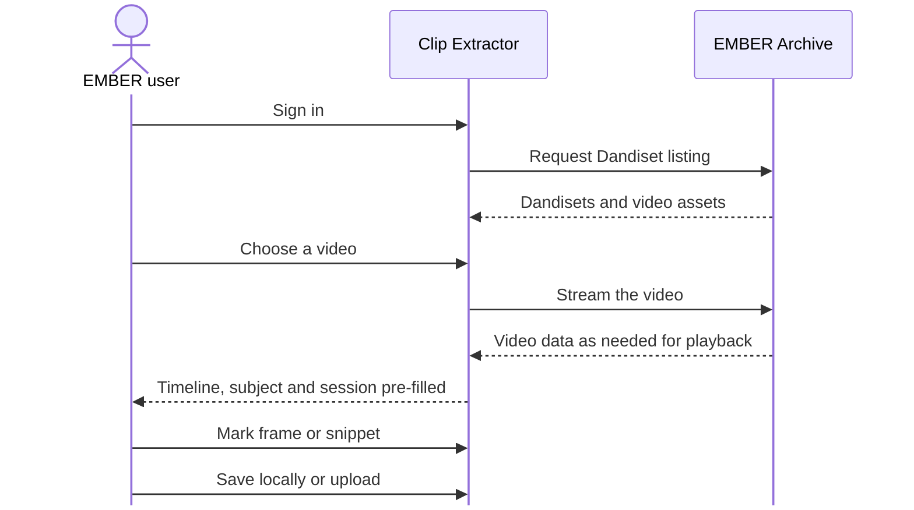

# Story 5: Clip a recording on EMBER without downloading it

**Persona:** Data steward; any signed-in EMBER user.

> As an **EMBER user**, I want to open a video that already lives in a Dandiset, scrub through it, and extract a clip, so that I never have to pull a multi-gigabyte file down to my laptop just to get a few seconds of it.

**Why it matters.** The archive is where the data lives. If every derived product requires a round trip through a local disk, the archive becomes a cold backup rather than a working environment. Streaming the video into the browser and extracting from there keeps the archive in the loop.

**Acceptance criteria**

- After signing in, I can browse the videos in a Dandiset from a pane inside the tool.
- Selecting a video starts playback from the archive without a full download.
- Subject and session information from the archive path is carried into the tool so the output can be named correctly.
- The tool records which dataset the clip came from so the output can reference its source.

---

[All Clip Extractor stories](README.md) · Previous: [Story 4](story-04-capture-a-reference-frame-for-a-skeleton-definition.md) · Next: [Story 6](story-06-upload-a-derivative-that-lands-in-the-right-place-with-the-right-name.md)
