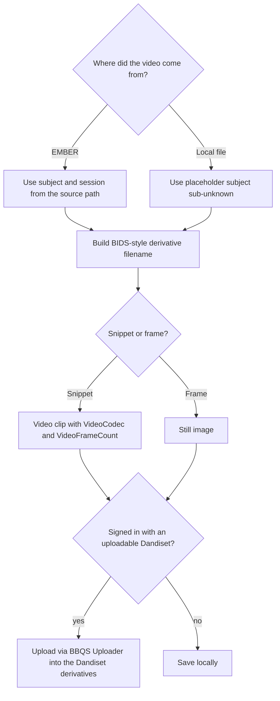

# Story 6: Upload a derivative that lands in the right place with the right name

**Persona:** Data steward for a BBQS lab.

> As a **data steward**, I want the clip I extracted to be uploaded straight into my lab's Dandiset with a BIDS-style name and derivative layout, so that it is discoverable and standard without me hand-editing filenames or running the DANDI CLI for a single file.

**Why it matters.** The [data standardization guide](../../docs/user-guide/data-standardization.md) describes the BIDS layout and naming that EMBER expects. Following it by hand for a single derived clip is error-prone and discouraging. If the tool that produced the clip also knows the source subject, session, and dataset, it can do the naming correctly every time.

**Acceptance criteria**

- When the source video came from EMBER, the uploaded clip is named using the source subject and session.
- When the source video was a local file with no metadata, the tool falls back to a clearly marked placeholder subject rather than guessing.
- The clip is placed as a derivative, not mixed in with raw source data.
- The upload goes through the same BBQS Uploader used for other archive uploads, so there is one authentication path and one set of upload rules.
- I can only upload into Dandisets I actually have access to; if I have none, the tool tells me and still lets me save locally.

---

[All Clip Extractor stories](README.md) · Previous: [Story 5](story-05-clip-a-recording-on-ember-without-downloading-it.md) · Next: [Story 7](story-07-work-with-multi-hour-recordings.md)
