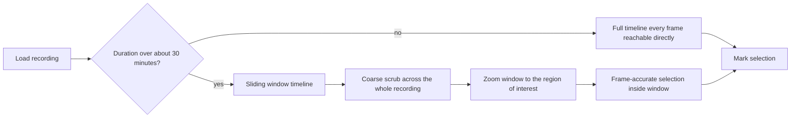

# Story 7: Work with multi-hour recordings

**Persona:** Behavioral annotator; pose estimation researcher.

> As a **researcher working with overnight or multi-hour recordings**, I want the timeline to stay responsive and precise even when the video is hours long, so that I can find a moment at hour three as easily as a moment at minute three.

**Why it matters.** Home-cage and continuous monitoring recordings are the norm in several BBQS projects, not the exception. A timeline designed for a two-minute clip becomes unusable at four hours: the scrubber loses precision and the preview stalls. If the tool cannot handle long recordings, it does not handle BBQS recordings.

**Acceptance criteria**

- For recordings longer than roughly half an hour, the timeline switches to a sliding window so I can zoom into a region and still pick individual frames.
- Preview frames are sampled rather than fully decoded so scrubbing stays responsive.
- Marking a range at hour three yields the same frame-accurate result as marking one at minute three.

---

[All Clip Extractor stories](README.md) · Previous: [Story 6](story-06-upload-a-derivative-that-lands-in-the-right-place-with-the-right-name.md) · Next: [Story 8](story-08-keep-audio-with-video-when-it-exists.md)
