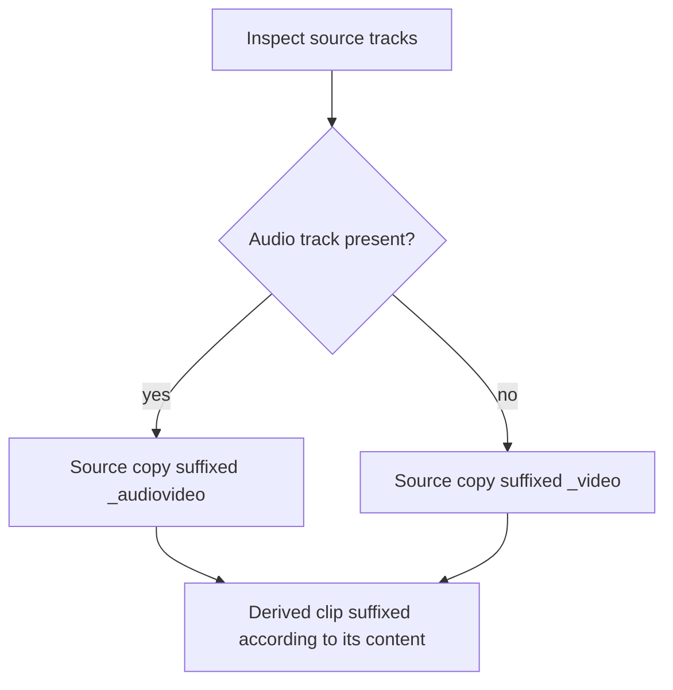

# Story 8: Keep audio with video when it exists

**Persona:** Data steward; researcher working with vocalization or multimodal recordings.

> As a **researcher with audio-and-video recordings**, I want the tool to recognize when a recording has an audio track and name and handle the output accordingly, so that the archive copy correctly reflects what the source actually contains.

**Why it matters.** BBQS explicitly covers multimodal behavior, including audio. BEP047 distinguishes between video-only and audio-video recordings. A tool that silently drops the distinction produces archive entries that are wrong in a way nobody notices until much later.

**Acceptance criteria**

- When the source has an audio track, the copy of the source data is labelled as audio-video rather than video-only.
- Derived clips keep the video suffix appropriate for what they contain.
- The presence or absence of audio does not change the frame-accuracy of the selection.

---

[All Clip Extractor stories](README.md) · Previous: [Story 7](story-07-work-with-multi-hour-recordings.md) · Next: [Story 9](story-09-nothing-leaves-the-browser-unless-i-say-so.md)
