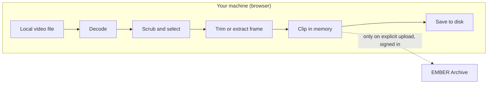

# Story 9: Nothing leaves the browser unless I say so

**Persona:** Compliance-minded PI; any user with sensitive recordings.

> As a **PI responsible for sensitive recordings**, I want the tool to decode and trim video entirely on my machine, so that opening a local file in the tool is never itself a disclosure.

**Why it matters.** Many "upload a video and we'll process it" services exist. None of them are acceptable for unreleased human subjects data or for embargoed animal data. The Clip Extractor's value depends on the guarantee that a locally opened file stays local until the user explicitly chooses to upload the result.

**Acceptance criteria**

- Opening a local file performs all decoding and trimming in the browser; no video data is sent to a server for processing.
- The only network transfer of clip content is the explicit upload step, which requires a signed-in user and a deliberate action.
- Saving locally is always available, even when signed out or when I have no Dandiset to upload to.

---

[All Clip Extractor stories](README.md) · Previous: [Story 8](story-08-keep-audio-with-video-when-it-exists.md) · Next: [Story 10](story-10-blur-people-before-sharing.md)
