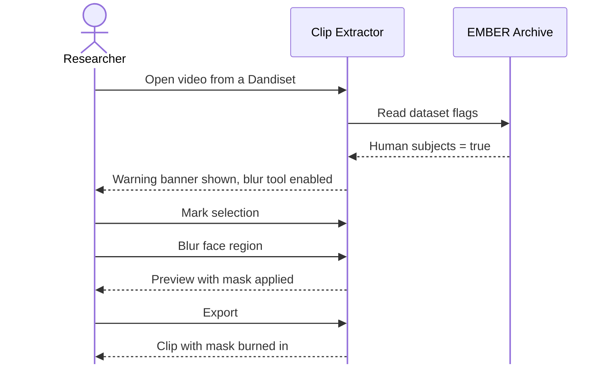

# Story 10: Blur people before sharing

**Persona:** Researcher working with human subjects video.

> As a **researcher working with human subjects data**, I want the tool to warn me when the dataset is flagged as containing human subjects and to give me a blur tool, so that I can redact faces or identifying features before a clip goes anywhere.

**Why it matters.** BBQS includes human intracranial and behavioral studies where video of participants is a core modality. The [data standardization guide](../../docs/user-guide/data-standardization.md) already cautions against sending PHI/PII to online validators. The same care has to apply to clips: a three-second excerpt of a participant's face is still identifiable.

**Acceptance criteria**

- When the dataset is flagged as involving human subjects, the tool shows a visible warning before I can export.
- A blur tool is available that lets me mask a region of the frame, and the mask is applied to the exported clip or still.
- The warning and blur tool do not depend on my remembering to turn them on; they appear because of the dataset flag.

---

[All Clip Extractor stories](README.md) · Previous: [Story 9](story-09-nothing-leaves-the-browser-unless-i-say-so.md) · Next: [Story 11](story-11-respect-embargo-status.md)
