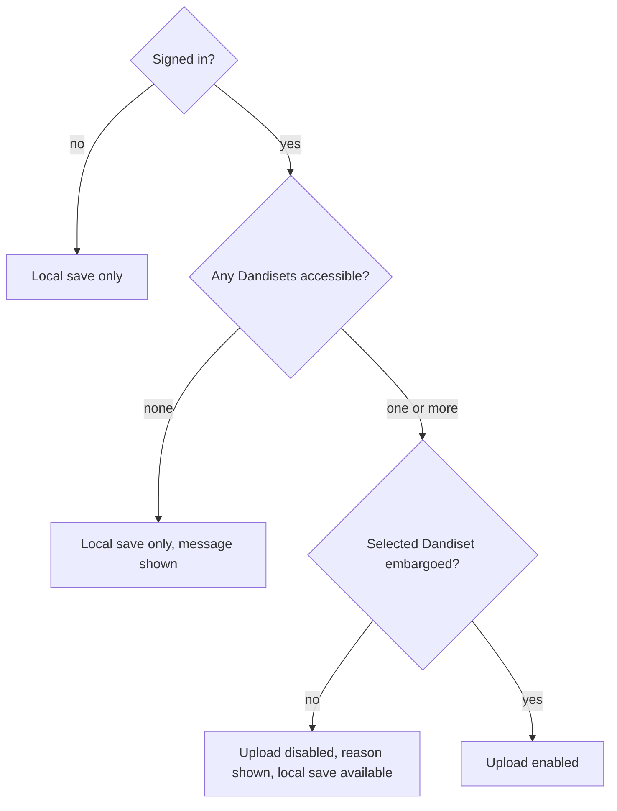

# Story 11: Respect embargo status

**Persona:** Data steward; compliance-minded PI.

> As a **data steward**, I want the tool to only allow uploads into Dandisets where adding a derivative is appropriate, and to tell me clearly when it is not, so that I cannot accidentally alter a published dataset from a browser tool.

**Why it matters.** Once a Dandiset is published and public, changes to it should go through the normal, reviewed publication process rather than through a quick upload from a clip tool. Embargoed (not yet public) Dandisets are where in-progress derivatives belong. The tool enforcing this rule removes a whole class of accidents.

**Acceptance criteria**

- For a Dandiset that is not embargoed, the upload option is disabled and the tool explains why.
- For an embargoed Dandiset I have access to, upload is available.
- If I am signed in but have no eligible Dandiset, the tool says so and offers local save instead of failing silently.
- Signed-out users can still use every local feature of the tool.

---

[All Clip Extractor stories](README.md) · Previous: [Story 10](story-10-blur-people-before-sharing.md) · Next: [Story 12](story-12-record-where-a-clip-came-from.md)
