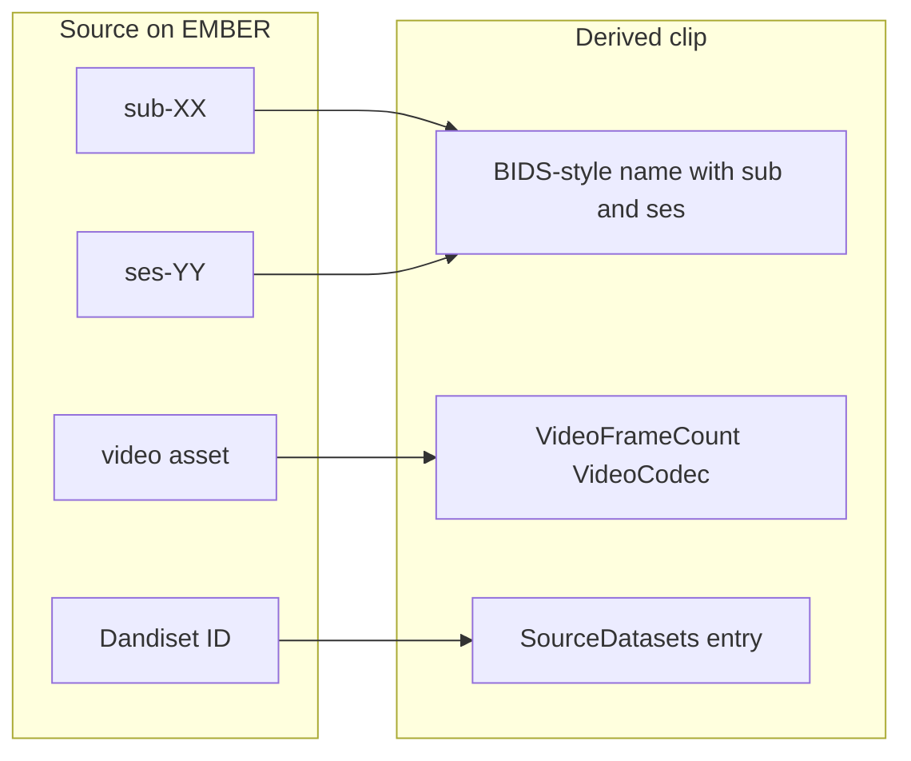

# Story 12: Record where a clip came from

**Persona:** Data steward; anyone who receives a clip.

> As a **person who receives or finds a clip**, I want the clip to say which recording, subject, session, dataset, and frame range it was taken from, so that I can go back to the original and trust what I am looking at.

**Why it matters.** A clip without provenance is an anecdote. A clip with provenance is evidence. The whole point of extracting from the archive rather than from a random local copy is that the archive can be cited. That only works if the derivative points back at its source.

**Acceptance criteria**

- Clips derived from EMBER sources carry a reference to the source dataset.
- Snippet exports include the frame count and codec, so the range can be re-derived from the source.
- The output naming preserves subject and session from the source.
- When the source is a local file with unknown provenance, the output makes that lack of provenance visible rather than inventing values.

---

[All Clip Extractor stories](README.md) · Previous: [Story 11](story-11-respect-embargo-status.md)
