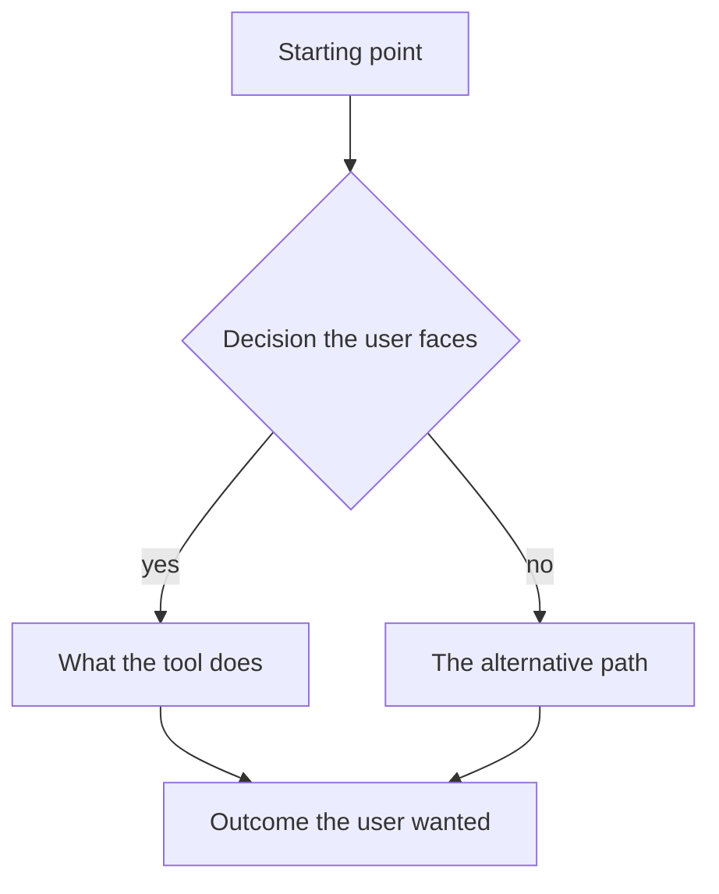

# Story N: Short title in sentence case

**Persona:** One line naming who this is for. Reuse a persona from the tool's `README.md` where one fits.

> As a **[kind of user]**, I want **[a capability]**, so that **[an outcome I care about]**.

**Why it matters.** Two to four sentences on the problem behind the story. Say what people do today and what that costs them: the workaround, the thing that gets lost, the step that gets skipped. This is the part that justifies building the capability, so keep it concrete and avoid restating the story.

**Acceptance criteria**

Two to five conditions, each checkable by someone other than the author. Write them from the user's point of view and make them specific enough to fail.

- The first thing that must be true for this story to be satisfied.
- The second thing, phrased so that a reviewer could try it and say yes or no.
- Where a limit matters (a duration, a format, a count), name it rather than saying "fast" or "large".

Optional. Any Mermaid type GitHub renders works; `flowchart`, `sequenceDiagram`, and `stateDiagram-v2` are used elsewhere in these pages. Do not put manual ` ` line breaks in labels, since the renderer wraps them on its own. Delete this block if the story reads fine without a diagram.

---

[All stories for this tool](README.md) · Previous: [Story N-1](story-NN-descriptor.md) · Next: [Story N+1](story-NN-descriptor.md)
